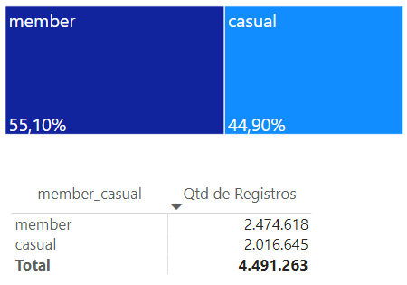
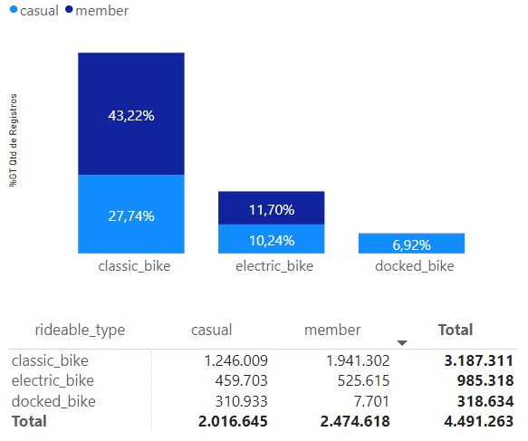
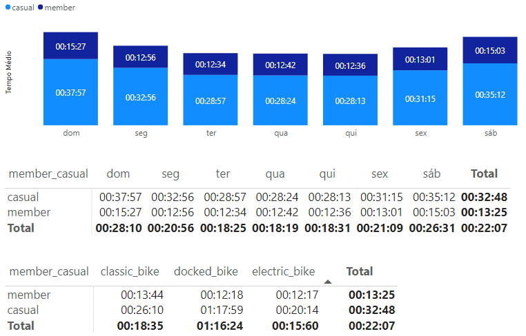
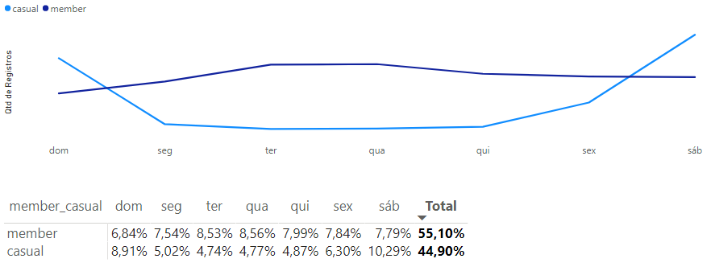
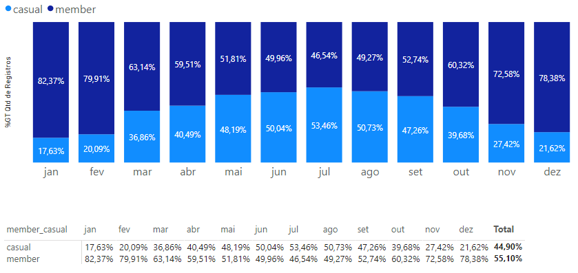

# Trip_data
## Projeto:
Google Data Analytics - Case Study

## Cenário: 
Analisar o banco de dados de uma empresa de compartilhamento de bicicletas situada em Chicago/IL, que contava com uma frota de 5.824 bicicletas, em 692 estações distribuidas pela cidade na época a ser analisada.

A Empresa tem três planos de preços: Single-Ride, Full-Day, e Annual Membership, onde os usuários Single-ride e Full-day são chamados de Usuários Casuais (Casual) e os Annual Membership como Usuários Membros (Member).

A Empresa também disponibiliza três tipos de bicicletas: Reclining Bike, Hand Tricycles, e Cargo Bikes para transformar o compartilhamento mais inclusivo à pessoas com necessidades especiais ou pessoas que não podem utilizar uma bicicleta comum com duas rodas.

## Objetivo do Projeto:
Verificar as diferenças de uso entre os Usuários Casuais e os Usuários Membros.

## Preparação da Fonte de Dados:
- Dados publicos: Motivate International Inc. (Divvy Bicycle Sharing Service from Chicago) - [**Ver Licença**](https://www.divvybikes.com/data-license-agreement)
- Período Analisado: Dezembro/2020 à Novembro/2021
- Arquivos fonte em formato .csv
- Os arquivos foram abertos para observar como se apresentam, como estão organizados e se apresentam erros ou outros problemas.
- Os Arquivos foram importados para o Banco de Dados SQL Server Management Studio.

## Processando, Limpando e Transformando os Dados:
- Foi criada uma coluna calculada de diferença de tempo de saída e de chegada em cada arquivo .csv para verificar valores inconsistentes com essa [**query**](Query_Add_Column)
- Os arquivos .csv importadas para o SQL Server foram unidas em uma única tabela através dessa [**query**](Query_Union_ALL)
- O número total de registros (linhas) a serem preparadas para análise é de 5.479.096
- Para retirar valores nulos, tempo de duração negativo ou zerado e id's duplicados foi utilizada essa [**Query**](Query_Cleaning_Data) 
- Total de registros a serem analizadas após o tratamento dos dados ficou em 4.491.263 (81,97% dos registros totais)

## Análise e Visualização de Dados:
O Banco de Dados Final, obtido através do SSMS (SQL Server Management Studio), foi importado para o Microsoft PowerBi, com a intenção de desenvolver os gráficos e realizar as análises.

   
  

  
>### Quantidade Total de Registros:

#### Observações
+ 55,10% dos registros são de Usuários Membros
+ 44,9% dos registros são dos Usuários Casuais

   
  

 
>### Quantidade de Eventos por Tipo de Bicicleta:

#### Observações
- 70,96% dos registros são de uso da Classic Bike, Sendo que desde percentual: 
   - 43,22% utilizado por Usuários Membros
   - 27,74% Utilizado por Usuários Casuais

   
  

 
>### Tempo Médio de Utilização (Duração) Por Dia da Semana:

#### Observações
- Usuários Membros: O tempo médio de utilização tem **menor variação** na semana e **menor duração**
- Usuários Casuais: O tempo médio de utilização tem **maior variação** na semana e **maior duração**
 

   
  

 
>### Tendência de Utilização Durante A Semana:

#### Observações
- Podemos observar que aos finais de semana, a quantidade de registros aumenta devido a maior participação dos Usuários Casuais
- Durante os dias úteis da semana, a participação dos Usuários Casuais cai consideravelmente
- A média de utilização dos Usuários Membros se mantém durante toda a semana

   
  

 
>### Quantidade de Eventos Por Mês do Ano

#### Observações
- O gráfico demonstra uma maior procura dos Usuários Casuais nos meses entre abril e setembro (acima de 40% dos registros)
- O Usuários Membros tem uma participação inversamente proporcional, sendo mais relevantes nos meses iniciais e finais do ano (acima de 60% dos registros)

   
  

  
## Conclusões e Recomendações
- Observando como os Usuários Membros utilizam as bikes, podemos concluir que o uso tem como finalidade principal o deslocamento para trabalho
- Observando o utilização por parte dos Usuários Casuais, podemos concluir que a principal finalidade de uso das bikes é para o lazer
- Como a média de utilização cai nos dias úteis por parte dos Usuários Casuais, seria interessante criar condições especiais para a utilização nesse período
- Nos Meses do meio do ano, há uma procura maior dos Usuários Casuais, o que sugere que talvez, criar condições especiais nos meses de início e fim de ano seja também uma possibilidade a ser avaliada pela área de marketing

   
  

  
## Autor do Projeto
Projeto realizado por Richard Gomes de Araújo em Dezembro/2021
- [**Linkedin**](https://www.linkedin.com/in/richardaraujoanalistadedados/)

   
  

  
>### Tecnologias Utilizadas
- Excel para visualizar os arquivos .csv
- SSMS (SQL Server Management Studio) para importar os arquivos .csv e unir em um banco de dados único
- Linguagem SQL para extrair, transformar e carregar os dados através de Views e outros comandas do SQL Server
- Microsoft PowerBI para importar os dados do SQL Server e criar os gráficos necessários para as análises:
    - Criando novas colunas para ajudar as análises por dia e por mês
    - Criando medidas com fórmula DAX como VARIÁVEIS (VAR), CALCULATE, DIVIDE, entre outras

